# Practical-NESTJS

This document presents the NestJS W-HRA (Warehouse Human Resource Allocation) system architecture using C4 model diagrams for better clarity and readability.

## System Context Diagram (Level 1)

## Container Diagram (Level 2)

## Module Data Flow Diagram

```mermaid
flowchart TD
    subgraph "External Systems"
        Users[👥 Users]
        Solace[📮 Solace Message Broker]
        PostgreSQL[(🗄️ PostgreSQL Database)]
        Redis[(🔴 Redis Cache)]
    end
    
    subgraph "W-HRA Planning System"
        subgraph "Application Layer"
            Controllers[🚪 REST API Controllers]
            AppServices[⚙️ Application Services]
            EventHandlers[⚡ Event Handlers]
        end
        
        subgraph "Domain Layer"
            SaleOrders[📦 Sale Orders]
            Shipments[🚚 Shipments]
            BizUnits[🏢 Business Units]
            ShipmentLanes[🛣️ Shipment Lanes]
            BizPartners[🤝 Business Partners]
            Customers[👤 Customers]
        end
        
        subgraph "Infrastructure Layer"
            DatabaseModule[🗄️ Database Module]
            CachingModule[💾 Caching Module]
            SolaceQueue[📮 Solace Queue Module]
            Calculator[🧮 Calculator Module]
        end
    end
    
    %% External to Application Flow
    Users --> Controllers
    
    %% Application Layer Flow
    Controllers --> AppServices
    AppServices --> EventHandlers
    
    %% Application to Domain Flow
    AppServices --> SaleOrders
    AppServices --> Shipments
    AppServices --> BizUnits
    
    %% Domain to Infrastructure Flow
    SaleOrders --> DatabaseModule
    Shipments --> DatabaseModule
    BizUnits --> DatabaseModule
    ShipmentLanes --> DatabaseModule
    BizPartners --> DatabaseModule
    Customers --> DatabaseModule
    
    %% Infrastructure to External Flow
    DatabaseModule --> PostgreSQL
    CachingModule --> Redis
    SolaceQueue --> Solace
    
    %% Cross-cutting Infrastructure Flow
    AppServices --> CachingModule
    AppServices --> Calculator
    EventHandlers --> SolaceQueue
    
    %% Async Event Flow
    EventHandlers -.-> Solace
    Solace -.-> Users
    
    %% Styling
    classDef external fill:#fff3e0,stroke:#f57c00,stroke-width:2px
    classDef application fill:#e3f2fd,stroke:#1976d2,stroke-width:2px
    classDef domain fill:#f3e5f5,stroke:#7b1fa2,stroke-width:2px
    classDef infrastructure fill:#e8f5e8,stroke:#388e3c,stroke-width:2px
    
    class Users,Solace,PostgreSQL,Redis external
    class Controllers,AppServices,EventHandlers application
    class SaleOrders,Shipments,BizUnits,ShipmentLanes,BizPartners,Customers domain
    class DatabaseModule,CachingModule,SolaceQueue,Calculator infrastructure
```

## C4 Model Overview

The architecture is presented using the **C4 Model** which provides different levels of abstraction:

### **Level 1: System Context** 
Shows the W-HRA system in its environment with users and external systems:

- **Users**:
  - **Warehouse Staff**: Primary users managing daily operations
  - **External Clients**: Third-party systems consuming APIs

- **External Systems**:
  - **Solace Message Broker**: Handles asynchronous messaging
  - **PostgreSQL Database**: Primary data storage
  - **Redis Cache**: Performance optimization layer

### **Level 2: Container Diagram**
Shows the major containers (applications/services) within the W-HRA system:

#### **Application Layer Containers**
- **REST API Controllers**: Entry points for HTTP requests
- **Application Services**: Business logic orchestration and validation  
- **Event Handlers**: CQRS event processing and integration

#### **Domain Layer Containers (Business Modules)**
- **Sale Orders Module**: Order lifecycle management
- **Shipments Module**: Shipment creation and tracking
- **Business Units Module**: Organizational unit management
- **Shipment Lanes Module**: Shipping routes and tariff management
- **Business Partners Module**: Partner relationship management
- **Customers Module**: Customer information management

#### **Infrastructure Layer Containers**
- **Database Module**: TypeORM-based data access layer
- **Caching Module**: Redis/memory caching abstraction
- **Solace Queue Module**: Message broker integration
- **Calculator Module**: Business calculation services

### **Key Design Patterns**

#### **Domain-Driven Design (DDD)**
- Each W-HRA module represents a bounded context
- Clear domain boundaries with encapsulated business logic
- Rich domain models with behavior and invariants

#### **CQRS (Command Query Responsibility Segregation)**
- Commands handled through application services
- Events processed by dedicated event handlers
- Clear separation between read and write operations

#### **Event-Driven Architecture**
- Asynchronous communication via Solace message broker
- Loose coupling between modules through events
- Scalable and responsive system design

#### **Modular Monolith**
- Self-contained modules with clear boundaries
- Shared infrastructure services
- Easy to extract into microservices if needed

### **Data Flow Patterns**

#### **Synchronous Request Flow**
1. **User Request**: Warehouse Staff/External Clients → REST API Controllers
2. **Business Logic**: Controllers → Application Services
3. **Domain Processing**: Application Services → Domain Modules
4. **Data Persistence**: Domain Modules → Database Module → PostgreSQL
5. **Response**: Data flows back through the same path

#### **Asynchronous Event Flow**
1. **Event Generation**: Domain Modules → Event Handlers
2. **Message Publishing**: Event Handlers → Solace Queue Module
3. **External Communication**: Solace Queue Module → Solace Message Broker
4. **Event Processing**: Solace Message Broker → External Systems

#### **Caching Flow**
1. **Cache Check**: Application Services → Caching Module → Redis Cache
2. **Cache Miss**: Fallback to Database Module → PostgreSQL
3. **Cache Update**: Store results in Redis Cache for future requests

### **Cross-Cutting Concerns**

- **Configuration**: Environment-based settings injected across all layers
- **Caching**: Performance optimization for frequently accessed data
- **Logging**: Comprehensive logging across all modules
- **Error Handling**: Consistent error handling and response patterns
- **Security**: Authentication and authorization (not shown in diagram)

### **Benefits of C4 Architecture Approach**

#### **Clear Communication**
- **Visual Hierarchy**: C4 diagrams provide different abstraction levels
- **Stakeholder Alignment**: System context shows business value
- **Technical Clarity**: Container diagrams show implementation structure

#### **Scalability Benefits**
- **Modular Containers**: Each domain module can be scaled independently
- **Event-Driven Communication**: Asynchronous processing prevents bottlenecks
- **Caching Strategy**: Performance optimization at multiple levels
- **Message Queuing**: Handles load spikes and system integration

#### **Maintainability Advantages**
- **Clear Boundaries**: Each container has well-defined responsibilities
- **Dependency Direction**: Clean dependency flow from outer to inner layers
- **Domain Separation**: Business logic isolated in domain modules
- **Infrastructure Abstraction**: Easy to test and swap implementations

#### **Flexibility & Evolution**
- **Container Independence**: Modules can evolve separately
- **Technology Agnostic**: Business logic independent of frameworks
- **Configuration Driven**: Behavior controlled through external configuration
- **Plugin Architecture**: Easy to add new modules or replace existing ones

#### **Operational Benefits**
- **Monitoring**: Clear container boundaries for observability
- **Deployment**: Containers can be deployed independently if needed
- **Debugging**: Issues can be isolated to specific containers
- **Performance**: Bottlenecks easily identified and addressed