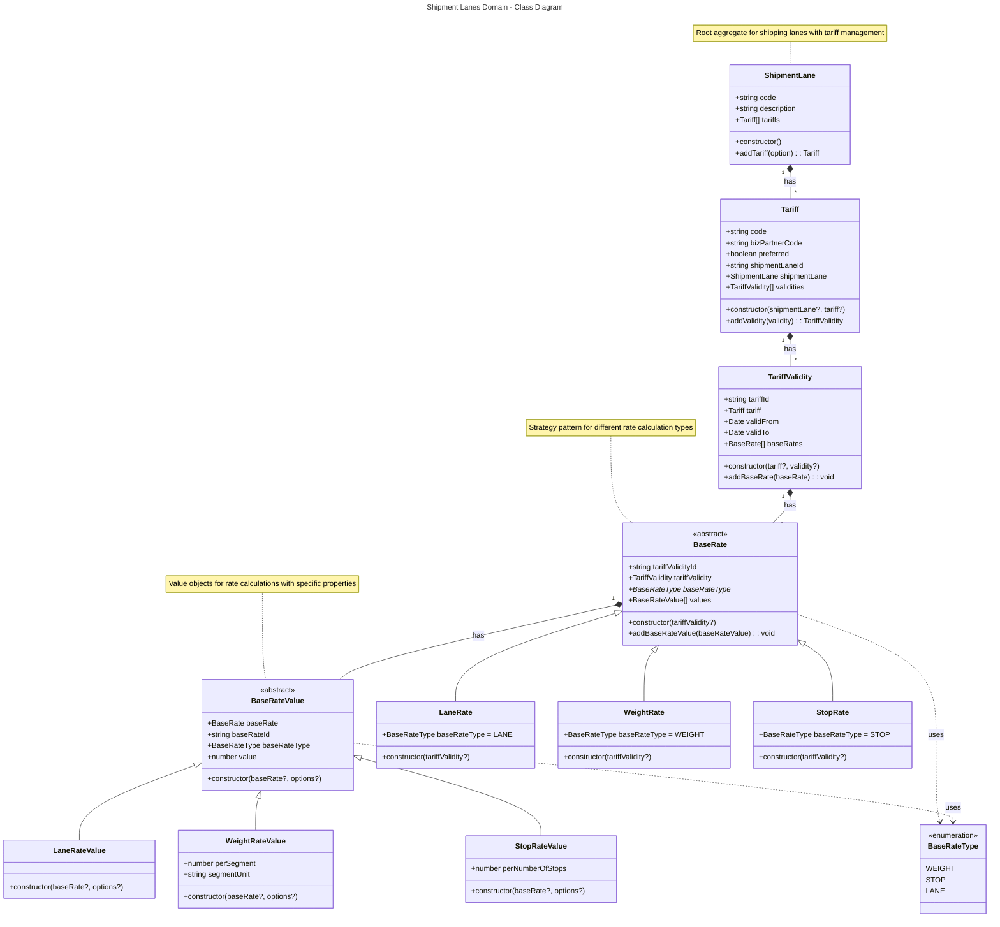

# Shipment Lanes Domain - Class Diagram

This class diagram represents the domain model for the shipment lanes module, showing the relationships between entities for managing shipping lanes, tariffs, and rate calculations.

## Key Design Patterns

### 1. **Domain-Driven Design (DDD)**
- `ShipmentLane` serves as the aggregate root
- Encapsulates business logic for managing tariffs and rates
- Clear boundaries between domain entities

### 2. **Strategy Pattern**
- `BaseRate` and its concrete implementations (`LaneRate`, `WeightRate`, `StopRate`)
- Different rate calculation strategies for various pricing models
- `BaseRateType` enum defines the available strategies

### 3. **Value Objects**
- Rate value classes contain specific calculation parameters
- Immutable data structures for rate calculations
- Each rate type has its own value object with specific properties

### 4. **Composition over Inheritance**
- Strong composition relationships between aggregates
- Clear ownership and lifecycle management
- Enforced through constructor parameters and factory methods

## Entity Relationships

1. **ShipmentLane** → **Tariff**: A shipping lane can have multiple tariffs from different business partners
2. **Tariff** → **TariffValidity**: Each tariff can have multiple validity periods
3. **TariffValidity** → **BaseRate**: Each validity period can have different types of rates
4. **BaseRate** → **BaseRateValue**: Each rate type can have multiple value configurations

## Rate Calculation Types

- **Lane Rate**: Fixed rates per lane with stops consideration
- **Weight Rate**: Rates based on weight segments (kg/lb)
- **Stop Rate**: Rates based on number of stops in the route