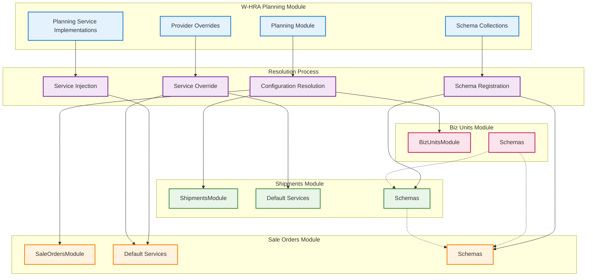
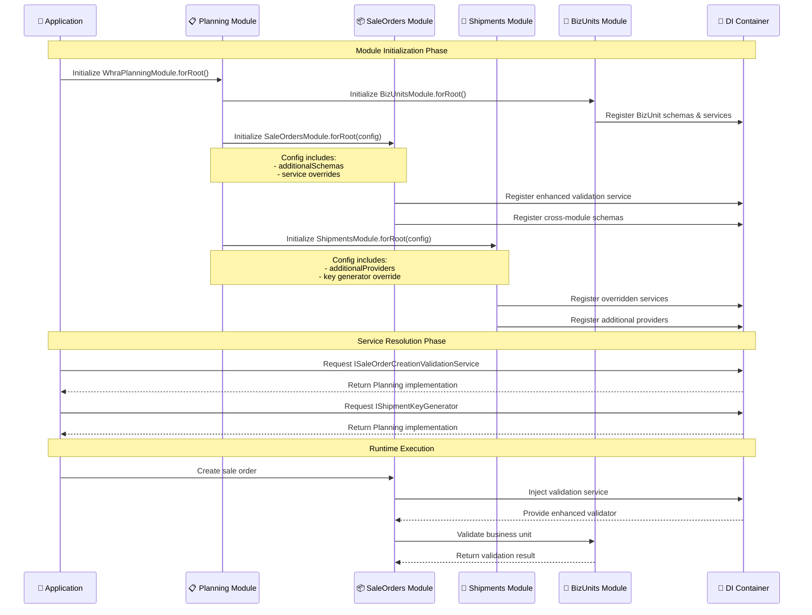

# Dependency Resolution Mechanism: W-HRA Planning & Modules

This document explains the sophisticated dependency resolution mechanism used between the `w-hra-planning` module and the `w-hra-modules` collection in the NestJS-based W-HRA (Warehouse Human Resource Allocation) system.

## Table of Contents

1. [Overview](#overview)
2. [Architecture Pattern](#architecture-pattern)
3. [Dependency Resolution Strategies](#dependency-resolution-strategies)
4. [Module Relationship Diagrams](#module-relationship-diagrams)
5. [Implementation Details](#implementation-details)
6. [Service Override Patterns](#service-override-patterns)
7. [Configuration Injection](#configuration-injection)
8. [Best Practices](#best-practices)

## Overview

The W-HRA system employs a **modular architecture** where:
- **`w-hra-modules`**: Contains business domain modules (core functionality)
- **`w-hra-planning`**: Contains the planning orchestration layer (application-specific implementations)

The dependency resolution mechanism allows the planning module to:
1. **Override default implementations** with specialized business logic
2. **Inject additional schemas** for cross-module database relationships
3. **Extend core functionality** while maintaining separation of concerns
4. **Configure modules dynamically** based on planning requirements

## Architecture Pattern

The system follows the **Dependency Inversion Principle** with these key patterns:

### 1. Interface-Based Service Resolution
```typescript
// Domain defines the contract
export interface ISaleOrderCreationValidationService {
    canCreateSaleOrder(saleOrder: SaleOrder): Promise<boolean>;
}

// Core module provides default implementation
export class DefaultSaleOrderCreationValidationService implements ISaleOrderCreationValidationService {
    // Basic implementation
}

// Planning module provides enhanced implementation
export class SaleOrderCreationValidationService extends DefaultSaleOrderCreationValidationService {
    // Enhanced implementation with additional business rules
}
```

### 2. Dynamic Module Configuration
```typescript
// Modules accept configuration for customization
export type SaleOrdersModuleSettings = {
    additionalSchemas?: any[],
    additionalProviders?: Provider[],
    saleOrderCreationValidationService?: Provider<ISaleOrderCreationValidationService>
};
```

### 3. Symbol-Based Dependency Injection
```typescript
// Services are identified by symbols for type-safe injection
export const SaleOrderCreationValidationServiceSymbol = "ISaleOrderCreationValidationService";
export const SHIPMENT_ASSIGNMENT_SERVICE = "IShipmentAssignmentService";
export const SHIPMENT_KEY_GENERATOR_SYMBOL = "IShipmentKeyGenerator";
```

## Dependency Resolution Strategies

### Strategy 1: Service Override Pattern

**Use Case**: Replace default business logic with enhanced implementations

```typescript
// 1. Planning module provides enhanced service
export class SaleOrderCreationValidationService extends DefaultSaleOrderCreationValidationService {
    constructor(
        @InjectRepository(BizUnit)
        private readonly bizUnitRepository: Repository<BizUnit>
    ) {
        super();
    }

    public async canCreateSaleOrder(saleOrder: SaleOrder): Promise<boolean> {
        // Call parent validation first
        const isValid = await super.canCreateSaleOrder(saleOrder);
        if (!isValid) return false;

        // Add additional business rule: verify business unit exists
        const bizUnit = await this.bizUnitRepository.findOne({
            where: { regions: { regionCode: Equal(saleOrder.regionCode) } },
            relations: { regions: true }
        });

        return !!bizUnit;
    }
}

// 2. Override registration in planning module
SaleOrdersModule.forRoot({
    saleOrderCreationValidationService: {
        provide: SaleOrderCreationValidationServiceSymbol,
        useClass: SaleOrderCreationValidationService // Enhanced implementation
    }
})
```

### Strategy 2: Schema Injection Pattern

**Use Case**: Enable cross-module database relationships

```typescript
// Planning module injects schemas from multiple modules
SaleOrdersModule.forRoot({
    additionalSchemas: [
        ...BizUnitsModuleSchemas,      // Enable BizUnit relationships
        ...Object.values(ShipmentsModuleSchemas) // Enable Shipment relationships
    ]
})

ShipmentsModule.forRoot({
    additionalSchemas: [
        ...BizUnitsModuleSchemas // Enable BizUnit relationships in Shipments
    ]
})
```

### Strategy 3: Provider Override Pattern

**Use Case**: Replace infrastructure services with specialized implementations

```typescript
// 1. Create enhanced provider
export const overrideShipmentKeyGeneratorServiceProvider: Provider<IShipmentKeyGenerator> = {
    provide: SHIPMENT_KEY_GENERATOR_SYMBOL,
    useClass: ShipmentKeyGeneratorService // Planning-specific implementation
};

// 2. Inject into module configuration
ShipmentsModule.forRoot({
    shipmentKeyGeneratorProvider: overrideShipmentKeyGeneratorServiceProvider
})
```

### Strategy 4: Additional Providers Pattern

**Use Case**: Add supplementary services to existing modules

```typescript
ShipmentsModule.forRoot({
    additionalProviders: [
        overrideShipmentAssigmentServiceProvider // Add extra service
    ]
})
```

## Module Relationship Diagrams

### Dependency Resolution Flow Diagram



### Service Override Class Diagram

```mermaid
classDiagram
    %% Interfaces
    class ISaleOrderCreationValidationService {
        <<interface>>
        +canCreateSaleOrder(saleOrder: SaleOrder) Promise~boolean~
    }
    
    class IShipmentKeyGenerator {
        <<interface>>
        +generateKey(shipment: Shipment) Promise~string~
    }
    
    class IShipmentAssignmentService {
        <<interface>>
        +assignSaleOrderToShipment(request: Assignment) Promise~void~
    }
    
    %% Default Implementations (w-hra-modules)
    class DefaultSaleOrderCreationValidationService {
        +canCreateSaleOrder(saleOrder: SaleOrder) Promise~boolean~
    }
    
    class DefaultShipmentKeyGenerator {
        +generateKey(shipment: Shipment) Promise~string~
    }
    
    %% Planning Implementations (w-hra-planning)
    class SaleOrderCreationValidationService {
        -bizUnitRepository: Repository~BizUnit~
        +canCreateSaleOrder(saleOrder: SaleOrder) Promise~boolean~
    }
    
    class ShipmentKeyGeneratorService {
        -settingsService: ShipmentLaneKeySettingsService
        +generateKey(shipment: Shipment) Promise~string~
    }
    
    class ShipmentAssignmentService {
        -shipmentRepository: Repository~Shipment~
        -saleOrderRepository: Repository~SaleOrder~
        +assignSaleOrderToShipment(request: Assignment) Promise~void~
    }
    
    %% Relationships
    ISaleOrderCreationValidationService <|.. DefaultSaleOrderCreationValidationService
    ISaleOrderCreationValidationService <|.. SaleOrderCreationValidationService
    DefaultSaleOrderCreationValidationService <|-- SaleOrderCreationValidationService
    
    IShipmentKeyGenerator <|.. DefaultShipmentKeyGenerator
    IShipmentKeyGenerator <|.. ShipmentKeyGeneratorService
    
    IShipmentAssignmentService <|.. ShipmentAssignmentService
    
    %% Dependencies
    SaleOrderCreationValidationService --> BizUnit : uses
    ShipmentKeyGeneratorService --> ShipmentLaneKeySettingsService : uses
    ShipmentAssignmentService --> Shipment : uses
    ShipmentAssignmentService --> SaleOrder : uses
    
    %% Domain Models
    class BizUnit {
        +id: string
        +code: string
        +regions: BizUnitRegion[]
    }
    
    class Shipment {
        +id: string
        +shipmentCode: string
        +status: ShipmentStatus
    }
    
    class SaleOrder {
        +id: string
        +saleOrderCode: string
        +regionCode: string
        +items: SaleOrderItem[]
    }
    
    classDef interface fill:#fff3e0,stroke:#f57c00,stroke-width:2px
    classDef defaultImpl fill:#e8f5e8,stroke:#388e3c,stroke-width:2px
    classDef planningImpl fill:#e3f2fd,stroke:#1976d2,stroke-width:2px
    classDef domain fill:#f3e5f5,stroke:#7b1fa2,stroke-width:2px
    
    class ISaleOrderCreationValidationService interface
    class IShipmentKeyGenerator interface
    class IShipmentAssignmentService interface
    class DefaultSaleOrderCreationValidationService defaultImpl
    class DefaultShipmentKeyGenerator defaultImpl
    class SaleOrderCreationValidationService planningImpl
    class ShipmentKeyGeneratorService planningImpl
    class ShipmentAssignmentService planningImpl
    class BizUnit domain
    class Shipment domain
    class SaleOrder domain
```



### Module Configuration Flow



## Implementation Details

### Module Configuration Structure

The planning module uses the **forRoot** pattern to configure domain modules:

```typescript
@Module({})
export class WhraPlanningModule {
    public static forRoot(): DynamicModule {
        return {
            module: WhraPlanningModule,
            global: true,
            imports: [
                // 1. Basic modules (no customization needed)
                BizUnitsModule.forRoot(),
                BizPartnersModule.forRoot(),
                CustomersModule.forRoot(),
                
                // 2. Infrastructure modules with additional providers
                SolaceQueueModule.forRoot({
                    additionalProviders: [...SolaceQueueIntegrationProviders]
                }),
                
                // 3. Business modules with service overrides and schema injection
                SaleOrdersModule.forRoot({
                    additionalSchemas: [
                        ...BizUnitsModuleSchemas,
                        ...Object.values(ShipmentsModuleSchemas)
                    ],
                    saleOrderCreationValidationService: {
                        provide: SaleOrderCreationValidationServiceSymbol,
                        useClass: SaleOrderCreationValidationService
                    }
                }),
                
                ShipmentsModule.forRoot({
                    additionalSchemas: [...BizUnitsModuleSchemas],
                    additionalProviders: [overrideShipmentAssigmentServiceProvider],
                    shipmentKeyGeneratorProvider: overrideShipmentKeyGeneratorServiceProvider
                }),
                
                ShipmentLanesModule.forRoot({
                    shipmentLaneKeySettingsServiceProvider: overrideShipmentLaneKeySettingsServiceProvider
                })
            ],
            providers: [...CqrsEventHandlers],
            controllers: [/* controllers */]
        } as DynamicModule;
    }
}
```

## Service Override Patterns

### Pattern 1: Extension Override
**Extend default functionality while preserving base behavior**

```typescript
export class SaleOrderCreationValidationService extends DefaultSaleOrderCreationValidationService {
    constructor(
        @InjectRepository(BizUnit)
        private readonly bizUnitRepository: Repository<BizUnit>
    ) {
        super();
    }

    public async canCreateSaleOrder(saleOrder: SaleOrder): Promise<boolean> {
        // 1. Call parent validation (composition)
        const isValid = await super.canCreateSaleOrder(saleOrder);
        if (!isValid) return false;

        // 2. Add additional business logic
        const bizUnit = await this.bizUnitRepository.findOne({
            where: { regions: { regionCode: Equal(saleOrder.regionCode) } },
            relations: { regions: true }
        });

        return !!bizUnit;
    }
}
```

### Pattern 2: Complete Replacement
**Provide entirely new implementation**

```typescript
export const overrideShipmentKeyGeneratorServiceProvider: Provider<IShipmentKeyGenerator> = {
    provide: SHIPMENT_KEY_GENERATOR_SYMBOL,
    useClass: ShipmentKeyGeneratorService // Completely new implementation
};
```

### Pattern 3: Factory Override
**Use factories for complex service creation**

```typescript
export const complexServiceProvider: Provider = {
    provide: COMPLEX_SERVICE_TOKEN,
    useFactory: (dep1: Service1, dep2: Service2) => {
        return new ComplexService(dep1, dep2, additionalConfig);
    },
    inject: [SERVICE1_TOKEN, SERVICE2_TOKEN]
};
```

## Configuration Injection

### Schema Injection Strategy

Cross-module relationships are enabled by injecting schemas:

```typescript
// Problem: SaleOrder needs to reference BizUnit and Shipment entities
// Solution: Inject their schemas into the SaleOrders module

SaleOrdersModule.forRoot({
    additionalSchemas: [
        ...BizUnitsModuleSchemas,      // Enables BizUnit relationships
        ...Object.values(ShipmentsModuleSchemas) // Enables Shipment relationships
    ]
})
```

### Provider Injection Strategy

Additional services can be injected into existing modules:

```typescript
ShipmentsModule.forRoot({
    additionalProviders: [
        // Inject a service that the core module doesn't know about
        {
            provide: 'CUSTOM_NOTIFICATION_SERVICE',
            useClass: CustomNotificationService
        }
    ]
})
```

## Best Practices

### 1. Interface Segregation
```typescript
// ✅ Good: Focused interfaces
interface ISaleOrderValidator {
    canCreateSaleOrder(saleOrder: SaleOrder): Promise<boolean>;
}

interface ISaleOrderProcessor {
    processSaleOrder(saleOrder: SaleOrder): Promise<void>;
}

// ❌ Bad: Fat interface
interface ISaleOrderService {
    canCreateSaleOrder(saleOrder: SaleOrder): Promise<boolean>;
    processSaleOrder(saleOrder: SaleOrder): Promise<void>;
    sendNotification(order: SaleOrder): Promise<void>;
    generateReport(order: SaleOrder): Promise<Report>;
}
```

### 2. Symbol-Based Injection
```typescript
// ✅ Good: Use symbols for type safety
export const SALE_ORDER_VALIDATOR = Symbol('ISaleOrderValidator');

@Injectable()
class SaleOrderController {
    constructor(
        @Inject(SALE_ORDER_VALIDATOR)
        private validator: ISaleOrderValidator
    ) {}
}

// ❌ Bad: String-based injection (error-prone)
@Inject('SaleOrderValidator')
```

### 3. Configuration Validation
```typescript
export type SaleOrdersModuleSettings = {
    additionalSchemas?: any[];
    additionalProviders?: Provider[];
    saleOrderCreationValidationService?: Provider<ISaleOrderCreationValidationService>;
};

// ✅ Good: Validate configuration
public static forRoot(settings?: SaleOrdersModuleSettings): DynamicModule {
    if (settings?.additionalSchemas?.some(schema => !schema)) {
        throw new Error('Invalid schema provided to SaleOrdersModule');
    }
    
    return {
        module: SaleOrdersModule,
        // ... configuration
    };
}
```

### 4. Graceful Defaults
```typescript
// ✅ Good: Provide sensible defaults
providers: [
    ...(settings?.additionalProviders || []),
    settings?.saleOrderCreationValidationService ?? {
        provide: SaleOrderCreationValidationServiceSymbol,
        useClass: DefaultSaleOrderCreationValidationService
    }
]
```

### 5. Clear Override Points
```typescript
// ✅ Good: Explicit override configuration
export type ShipmentsModuleSettings = {
    additionalSchemas?: any[];
    additionalProviders?: Provider[];
    shipmentKeyGeneratorProvider?: Provider<IShipmentKeyGenerator>; // Clear override point
};
```

## Benefits of This Approach

1. **Separation of Concerns**: Core modules remain focused on domain logic
2. **Flexibility**: Planning module can customize behavior without modifying core code
3. **Testability**: Easy to mock and test individual components
4. **Maintainability**: Changes in planning logic don't affect core modules
5. **Reusability**: Core modules can be used in different contexts
6. **Type Safety**: Interface-based design ensures compile-time type checking
7. **Dependency Inversion**: High-level modules don't depend on low-level implementation details

This dependency resolution mechanism enables a clean, maintainable, and flexible architecture that supports both current requirements and future extensibility.