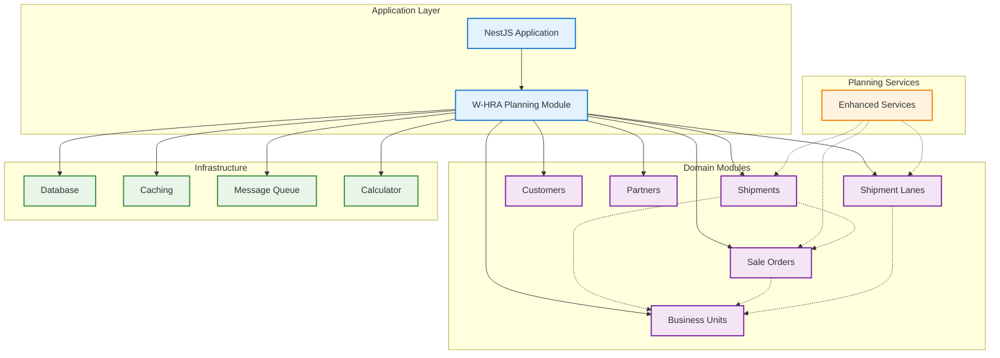

# W-HRA System Module Dependencies Overview

This diagram provides a high-level overview of how the `w-hra-planning` module resolves dependencies with the `w-hra-modules` collection.

## Module Architecture Overview

## Dependency Resolution Strategies

```mermaid
flowchart LR
    subgraph "Resolution Patterns"
        subgraph "Service Override"
            SO_IF[Interface]
            SO_DEF[Default Impl]
            SO_ENH[Enhanced Impl]
            
            SO_IF --> SO_DEF
            SO_IF --> SO_ENH
            SO_ENH -.-> SO_DEF
        end
        
        subgraph "Schema Injection"
            MOD_A[Module A]
            MOD_B[Module B]
            SCHEMA_B[Schema B]
            
            SCHEMA_B -.-> MOD_A
            MOD_B --> SCHEMA_B
        end
        
        subgraph "Provider Addition"
            BASE_MOD[Base Module]
            ADD_PROV[Additional Provider]
            ENH_MOD[Enhanced Module]
            
            BASE_MOD --> ENH_MOD
            ADD_PROV --> ENH_MOD
        end
        
        subgraph "Configuration Injection"
            CONFIG[Configuration]
            DYN_MOD[Dynamic Module]
            CUSTOM_MOD[Customized]
            
            CONFIG --> DYN_MOD
            DYN_MOD --> CUSTOM_MOD
        end
    end
    
    classDef interface fill:#fff3e0,stroke:#f57c00,stroke-width:2px
    classDef default fill:#e8f5e8,stroke:#388e3c,stroke-width:2px
    classDef enhanced fill:#e3f2fd,stroke:#1976d2,stroke-width:2px
    classDef module fill:#f3e5f5,stroke:#7b1fa2,stroke-width:2px
    classDef config fill:#fce4ec,stroke:#c2185b,stroke-width:2px
    
    class SO_IF interface
    class SO_DEF,BASE_MOD default
    class SO_ENH,ENH_MOD,CUSTOM_MOD enhanced
    class MOD_A,MOD_B,DYN_MOD module
    class SCHEMA_B,ADD_PROV,CONFIG config
```

## Key Benefits

### 🎯 **Separation of Concerns**
- Core modules handle domain logic
- Planning module handles application-specific orchestration
- Clear boundaries between layers

### 🔧 **Flexible Customization**
- Override default implementations without modifying core code
- Inject additional functionality through configuration
- Maintain backward compatibility

### 🧪 **Enhanced Testability**
- Interface-based dependency injection
- Easy mocking and stubbing
- Isolated unit testing

### 📈 **Scalable Architecture**
- Add new modules without affecting existing ones
- Cross-module relationships managed through schema injection
- Event-driven communication through message queues

### 🛡️ **Type Safety**
- Symbol-based service registration
- Interface contracts enforced at compile time
- Configuration validation prevents runtime errors