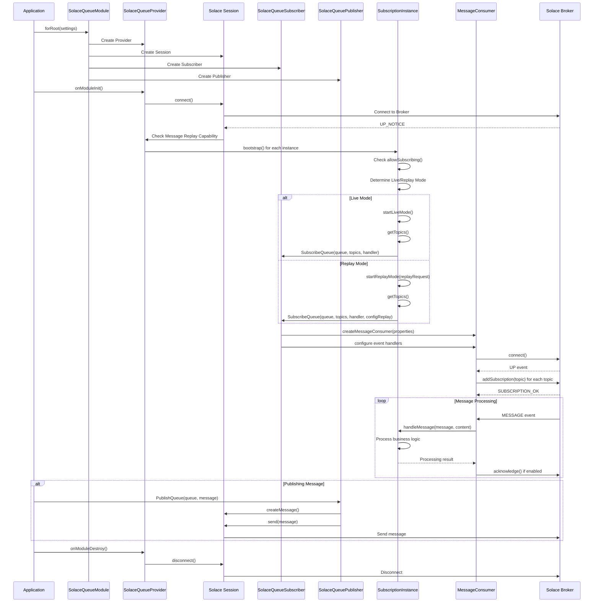
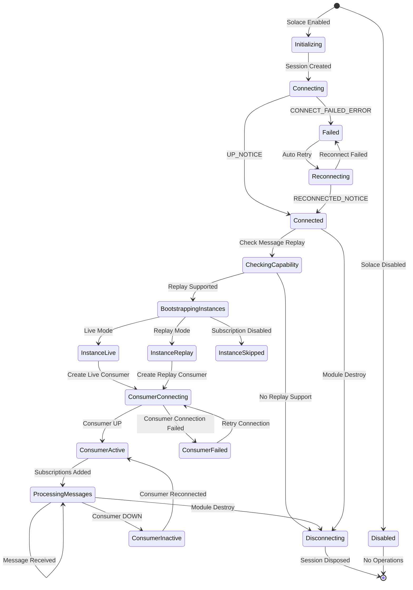

# Solace Queue Activity Diagram

## Message Processing Flow

```mermaid
flowchart TD
    Start(["Application Start"]) --> CheckEnabled{"Solace Enabled?"}
    
    CheckEnabled -->|No| Disabled["Log: Solace is disabled"]
    CheckEnabled -->|Yes| InitModule["Initialize SolaceQueueModule"]
    
    InitModule --> CreateSession["Create Solace Session"]
    CreateSession --> ConfigSession["Configure Session Properties"]
    ConfigSession --> ConnectSession["Connect to Solace Broker"]
    
    ConnectSession --> SessionEvents{"Session Events"}
    
    SessionEvents -->|CONNECT_FAILED_ERROR| ConnectError["Log Connection Error"]
    SessionEvents -->|UP_NOTICE| CheckCapability{"Message Replay Capable?"}
    SessionEvents -->|DISCONNECTED| SessionDisconnected["Log Disconnection & Dispose"]
    SessionEvents -->|RECONNECTING_NOTICE| Reconnecting["Log Reconnecting"]
    SessionEvents -->|RECONNECTED_NOTICE| Reconnected["Log Reconnected"]
    
    CheckCapability -->|No| DisconnectNoReplay["Disconnect - No Replay Support"]
    CheckCapability -->|Yes| BootstrapInstances["Bootstrap Subscription Instances"]
    
    BootstrapInstances --> ForEachInstance{"For Each Instance"}
    ForEachInstance --> InstanceBootstrap["Instance.bootstrap()"]
    
    InstanceBootstrap --> CheckSubscribing{"Allow Subscribing?"}
    CheckSubscribing -->|No| SkipSubscription["Log: Disabled subscribe"]
    CheckSubscribing -->|Yes| DetermineMode{"Live or Replay Mode?"}
    
    DetermineMode -->|Live Mode| StartLive["Start Live Mode"]
    DetermineMode -->|Replay Mode| StartReplay["Start Replay Mode"]
    
    StartLive --> GetTopicsLive["Get Topics from Configuration"]
    GetTopicsLive --> CreateConsumerLive["Create Message Consumer - Live"]
    CreateConsumerLive --> ConnectConsumerLive["Connect Consumer to Queue"]
    
    StartReplay --> GetTopicsReplay["Get Topics from Configuration"]
    GetTopicsReplay --> ConfigReplay["Configure Replay Parameters"]
    ConfigReplay --> CreateConsumerReplay["Create Message Consumer - Replay"]
    CreateConsumerReplay --> ConnectConsumerReplay["Connect Consumer to Queue"]
    
    ConfigReplay --> ReplayType{"Replay Type?"}
    ReplayType -->|From Date| SetReplayDate["Set Replay Start Date"]
    ReplayType -->|From Message ID| SetReplayMsgId["Set Replay Message ID"]
    ReplayType -->|From Beginning| SetReplayBeginning["Set Replay Beginning"]
    
    ConnectConsumerLive --> ConsumerEvents{"Consumer Events"}
    ConnectConsumerReplay --> ConsumerEvents
    
    ConsumerEvents -->|ACTIVE| ConsumerActive["Log: Consumer Active"]
    ConsumerEvents -->|INACTIVE| ConsumerInactive["Log: Consumer Inactive"]
    ConsumerEvents -->|UP| AddSubscriptions["Add Topic Subscriptions"]
    ConsumerEvents -->|DOWN| ConsumerDown["Log: Consumer Down & Dispose"]
    ConsumerEvents -->|MESSAGE| ProcessMessage["Process Incoming Message"]
    
    AddSubscriptions --> SubscribeTopics{"For Each Topic"}
    SubscribeTopics --> AddTopicSub["Add Topic Subscription"]
    AddTopicSub --> SubEvents{"Subscription Events"}
    
    SubEvents -->|SUBSCRIPTION_OK| SubSuccess["Log: Subscription Added"]
    SubEvents -->|SUBSCRIPTION_ERROR| SubError["Log: Subscription Error"]
    
    ProcessMessage --> CheckMessageType{"Message Type?"}
    CheckMessageType -->|TEXT| ExtractTextContent["Extract SDT Container Value"]
    CheckMessageType -->|BINARY| ExtractBinaryContent["Extract Binary Attachment"]
    
    ExtractTextContent --> HandleMessage["Call handleMessage()"]
    ExtractBinaryContent --> HandleMessage
    
    HandleMessage --> MessageProcessing{"Message Processing"}
    MessageProcessing -->|Success| AckCheck{"Acknowledge Enabled?"}
    MessageProcessing -->|Error| LogError["Log Processing Error"]
    
    LogError --> AckCheck
    AckCheck -->|Yes| AckMessage["Acknowledge Message"]
    AckCheck -->|No| MessageComplete["Message Processing Complete"]
    AckMessage --> MessageComplete
    
    MessageComplete --> WaitForNext["Wait for Next Message"]
    WaitForNext --> ConsumerEvents
    
    %% Publishing Flow
    PublishStart(["Publish Message"]) --> CheckPubEnabled{"Solace Enabled?"}
    CheckPubEnabled -->|No| PubDisabled["Log: Solace Disabled"]
    CheckPubEnabled -->|Yes| CheckDestType{"Destination Type?"}
    
    CheckDestType -->|Queue| ValidateQueue{"Queue Name Valid?"}
    CheckDestType -->|Topic| ValidateTopic{"Topic Name Valid?"}
    
    ValidateQueue -->|No| QueueError["Log: Queue is empty"]
    ValidateQueue -->|Yes| CreateQueueDest["Create Queue Destination"]
    
    ValidateTopic -->|No| TopicError["Log: Topic is empty"]
    ValidateTopic -->|Yes| CreateTopicDest["Create Topic Destination"]
    
    CreateQueueDest --> CreateMessage["Create Solace Message"]
    CreateTopicDest --> CreateMessage
    
    CreateMessage --> SetDestination["Set Message Destination"]
    SetDestination --> SetContent["Set Binary Attachment (JSON)"]
    SetContent --> SetDeliveryMode["Set Direct Delivery Mode"]
    SetDeliveryMode --> SendMessage["Send Message via Session"]
    
    SendMessage --> PublishComplete["Message Published"]
    
    %% Module Destruction
    ModuleDestroy(["Module Destroy"]) --> CheckDestroyEnabled{"Solace Enabled?"}
    CheckDestroyEnabled -->|No| DestroyDisabled["Log: Solace Disabled"]
    CheckDestroyEnabled -->|Yes| DisconnectSession["Disconnect Session"]
    DisconnectSession --> CleanupComplete["Cleanup Complete"]
    
    %% Styling
    classDef startEnd fill:#e1f5fe
    classDef process fill:#f3e5f5
    classDef decision fill:#fff3e0
    classDef error fill:#ffebee
    classDef success fill:#e8f5e8
    
    class Start,PublishStart,ModuleDestroy startEnd
    class InitModule,CreateSession,ConfigSession,ConnectSession,BootstrapInstances,CreateMessage process
    class CheckEnabled,SessionEvents,CheckCapability,CheckSubscribing,DetermineMode,ReplayType decision
    class ConnectError,DisconnectNoReplay,LogError,QueueError,TopicError error
    class PublishComplete,CleanupComplete,MessageComplete success
```

## Component Interaction Sequence

## State Machine Diagram

## Key Flow Descriptions

### 1. **Module Initialization Flow**
- Check if Solace is enabled via configuration
- Create and configure Solace session with broker details
- Initialize subscription instances and providers
- Establish connection to Solace message broker

### 2. **Subscription Flow**
- Bootstrap each subscription instance
- Determine operation mode (Live vs Replay)
- Create message consumers with appropriate configurations
- Add topic subscriptions for message filtering
- Handle connection events and errors

### 3. **Message Processing Flow**
- Receive messages from subscribed topics/queues
- Extract message content (TEXT or BINARY)
- Execute custom message handler logic
- Acknowledge messages if enabled
- Handle processing errors gracefully

### 4. **Replay Mode Flow**
- Configure replay start location (Date, Message ID, or Beginning)
- Create specialized message consumer with replay properties
- Process historical messages from specified starting point
- Transition to live mode after replay completion

### 5. **Publishing Flow**
- Validate destination (Queue or Topic)
- Create Solace message with JSON content
- Set delivery mode and destination
- Send message through established session

### 6. **Error Handling & Resilience**
- Connection retry mechanisms
- Session event monitoring
- Consumer reconnection logic
- Graceful degradation when features unavailable

This activity diagram shows the complete lifecycle of the Solace Queue integration, from module initialization through message processing and cleanup, including both normal operation flows and error handling scenarios.