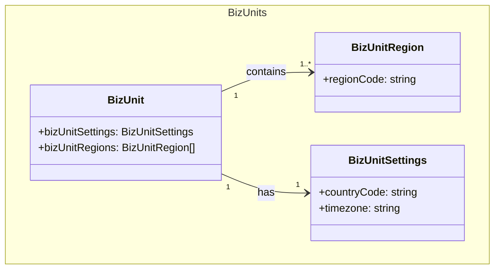
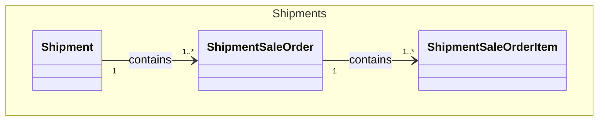

# Shipments module

## Class diagrams

```mermaid

classDiagram

BizUnit "1" --> "1..*" BizUnitRegion: contains
BizUnit "1" --> "1" BizUnitSettings: has

namespace BizUnits {
    class BizUnit {
        +bizUnitSettings: BizUnitSettings
        +bizUnitRegions: BizUnitRegion[]
    }

    class BizUnitSettings {
        +countryCode: string
        +timezone: string
    }

    class BizUnitRegion {
        +regionCode: string
    }
}

```

```mermaid
classDiagram

Shipment "1" --> "1..*" ShipmentSaleOrder: contains
ShipmentSaleOrder "1" --> "1..*" ShipmentSaleOrderItem: contains

namespace Shipments {
    class Shipment { }
    class ShipmentSaleOrder { }
    class ShipmentSaleOrderItem { }
}
```