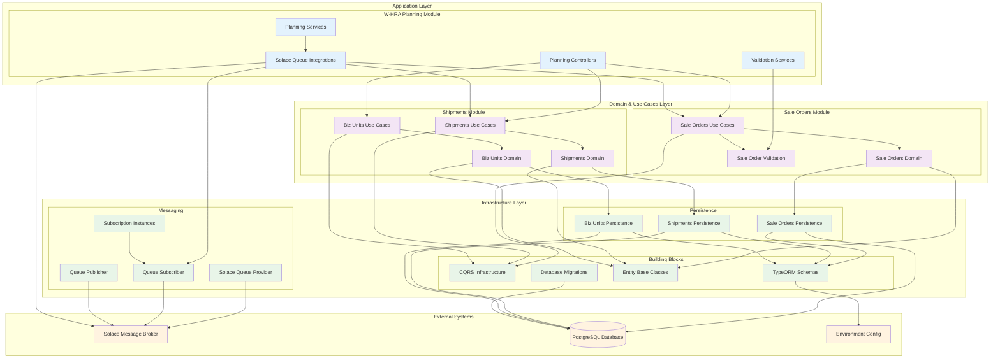

# W-HRA System Architecture

## Overview

The W-HRA system is a modular NestJS application designed with Domain-Driven Design (DDD) principles, CQRS pattern, and enterprise messaging capabilities through Solace queue integration.

## Architecture Diagram



## Detailed Component Architecture

### 1. Application Layer - W-HRA Planning Module

#### Controllers
- **[`BizUnitsController`](src/w-hra-planning/controllers/biz-units.controller.ts)**
  - Handles HTTP requests for business unit operations
  - POST `/biz-units` - Creates new business units

- **[`SaleOrdersController`](src/w-hra-planning/controllers/sale-orders.controller.ts)**
  - Manages sale order HTTP endpoints
  - POST `/sale-orders` - Creates new sale orders

#### Services
- **[`SaleOrderCreationValidationService`](src/w-hra-planning/services/validations/saleorder-creation-verification.service.ts)**
  - Custom validation logic extending default validation
  - Validates region codes against business units

#### Solace Queue Integrations
- **[`SaleOrderQueueIntegrationService`](src/w-hra-planning/services/solace-queue-integrations/sale-orders/sale-order-queue-integration.service.ts)**
  - Handles sale order messages from Solace queues
  - Supports both live and replay modes

- **[`ShipmentsQueueIntegrationService`](src/w-hra-planning/services/solace-queue-integrations/shipments/shipments-queue-integration.service.ts)**
  - Processes shipment messages from message broker
  - Configurable topic subscriptions

### 2. Domain & Use Cases Layer

#### Sale Orders Module
**Domain Models:**
- **[`SaleOrder`](src/w-hra-modules/sale-orders/domain/models/sale-order.ts)**
  - Core sale order aggregate root
  - Contains sale order items collection

- **[`SaleOrderItem`](src/w-hra-modules/sale-orders/domain/models/sale-order-item.ts)**
  - Sale order line items with product and quantity

**Use Cases:**
- **[`CreateSaleOrderCommand`](src/w-hra-modules/sale-orders/use-cases/commands/create/create-sale-order.command.ts)**
- **[`CreateSaleOrderHandler`](src/w-hra-modules/sale-orders/use-cases/commands/create/create-sale-order.handler.ts)**
  - CQRS command handler for sale order creation
  - Integrates validation services

#### Shipments Module
**Domain Models:**
- **[`Shipment`](src/w-hra-modules/shipments/domain/models/shipments/shipment.ts)**
  - Shipment aggregate root with complex relationships

- **[`ShipmentSaleOrder`](src/w-hra-modules/shipments/domain/models/shipments/shipment-sale-order.ts)**
- **[`ShipmentSaleOrderItem`](src/w-hra-modules/shipments/domain/models/shipments/shipment-sale-order-item.ts)**

- **[`BizUnit`](src/w-hra-modules/shipments/domain/models/biz-units/biz-unit.ts)**
  - Business unit aggregate with regions and settings

- **[`BizUnitRegion`](src/w-hra-modules/shipments/domain/models/biz-units/biz-unit-region.ts)**
- **[`BizUnitSettings`](src/w-hra-modules/shipments/domain/models/biz-units/biz-unit-settings.ts)**

**Use Cases:**
- **[`CreateShipmentCommand`](src/w-hra-modules/shipments/use-cases/commands/shipments/create/create-shipment.command.ts)**
- **[`CreateBizUnitCommand`](src/w-hra-modules/shipments/use-cases/commands/biz-units/create/create-biz-unit.command.ts)**

### 3. Infrastructure Layer

#### Persistence
- **TypeORM Schemas**: Entity mappings for all domain models
- **Database Migrations**: Version-controlled schema changes
- **Repository Pattern**: Data access abstraction

#### Messaging Infrastructure
- **[`SolaceQueueProvider`](src/w-hra-modules/solace-queue/solace-queue.provider.ts)**
  - Manages Solace connections and lifecycle
  - Handles session events and reconnection

- **[`SolaceQueueSubscriber`](src/w-hra-modules/solace-queue/operators/solace-queue.subscriber.ts)**
  - Queue subscription management
  - Message acknowledgment handling

- **[`SolaceQueuePublisher`](src/w-hra-modules/solace-queue/operators/solace-queue.publisher.ts)**
  - Message publishing to topics and queues

- **[`SubscriptionInstanceBase`](src/w-hra-modules/solace-queue/instances/subscription-instance.base.ts)**
  - Abstract base for queue subscriptions
  - Replay functionality support

## Key Architectural Patterns

### 1. Domain-Driven Design (DDD)
- **Aggregates**: `SaleOrder`, `Shipment`, `BizUnit`
- **Value Objects**: `BizUnitSettings`
- **Domain Services**: Validation services
- **Repositories**: Data access abstraction

### 2. Command Query Responsibility Segregation (CQRS)
- **Commands**: `CreateSaleOrderCommand`, `CreateShipmentCommand`, `CreateBizUnitCommand`
- **Command Handlers**: Process business logic
- **Command Bus**: Message routing

### 3. Dependency Injection
- NestJS DI container throughout all layers
- Interface-based abstractions
- Factory patterns for configuration

### 4. Event-Driven Architecture
- Solace message broker integration
- Async message processing
- Replay capabilities for message recovery

### 5. Modular Architecture
- Self-contained modules with clear boundaries
- Dynamic module configuration
- Cross-module dependency injection

## Data Flow Patterns

### HTTP Request Flow
```
HTTP Request → Controller → Command Bus → Command Handler → Domain Model → Repository → Database
```

### Message Queue Flow
```
Solace Queue → Queue Integration Service → Command Bus → Command Handler → Domain Model → Repository → Database
```

### Cross-Module Validation Flow
```
Planning Module → Custom Validation Service → Domain Repository → Business Logic → Validation Result
```

## Configuration & Environment

### Solace Configuration
- Connection settings via environment variables
- Queue and topic configuration
- Message acknowledgment settings
- Replay functionality configuration

### Database Configuration
- PostgreSQL connection through TypeORM
- Schema synchronization
- Migration management

## Scalability & Resilience

### Message Processing
- Configurable message window sizes
- Connection retry mechanisms
- Message replay for disaster recovery
- Dead letter queue handling

### Database Operations
- Connection pooling
- Transaction management
- Soft delete patterns
- Audit trails through base entities

### Monitoring & Logging
- Structured logging throughout all layers
- Session event monitoring
- Error handling and reporting
- Performance metrics collection

## Future Considerations

### Potential Enhancements
1. **Event Sourcing**: Store domain events for complete audit trail
2. **Read Models**: Separate query models for performance
3. **Distributed Caching**: Redis integration for frequently accessed data
4. **API Gateway**: Centralized routing and security
5. **Microservices**: Split modules into separate services
6. **Health Checks**: Application and dependency monitoring
7. **Circuit Breakers**: Fault tolerance patterns
8. **Rate Limiting**: API protection mechanisms

This architecture provides a solid foundation for a scalable, maintainable enterprise system with clear separation of concerns and robust messaging capabilities.