# W-HRA System Architecture

This document describes the architecture of the W-HRA (Warehouse Human Resource Allocation) Planning Module system.

## Table of Contents

1. [System Overview](#system-overview)
2. [Architecture Principles](#architecture-principles)
3. [Layer Structure](#layer-structure)
4. [Architecture Diagrams](#architecture-diagrams)
5. [Architecture Layers](#architecture-layers)
6. [Design Patterns & Principles](#design-patterns--principles)
7. [External Integrations](#external-integrations)
8. [Data Flow](#data-flow)
9. [Key Benefits](#key-benefits)
10. [Configuration](#configuration)

## System Overview

The W-HRA (Warehouse Human Resource Allocation) Planning Module is a sophisticated system designed to manage warehouse operations including sale orders, shipments, and business unit coordination. The system provides efficient resource allocation and planning capabilities for warehouse management.

### Core Capabilities
- **Sale Order Management**: Complete lifecycle management of sales orders
- **Shipment Planning**: Efficient shipment creation and tracking
- **Business Unit Administration**: Multi-region business unit management
- **Resource Allocation**: Intelligent warehouse resource planning
- **Real-time Integration**: Asynchronous communication with external systems

## Architecture Principles

The W-HRA system is built on several key architectural principles:

### Clean Architecture
- **Dependency Inversion**: Dependencies point inward toward the domain
- **Layer Isolation**: Each layer has clear responsibilities and boundaries
- **Framework Independence**: Business logic is independent of external frameworks

### Domain-Driven Design (DDD)
- **Ubiquitous Language**: Consistent terminology across the system
- **Bounded Contexts**: Clear module boundaries for different business areas
- **Rich Domain Models**: Business logic encapsulated in domain entities

### Event-Driven Architecture
- **Loose Coupling**: Components communicate through events
- **Scalability**: Asynchronous processing for better performance
- **Resilience**: Fault tolerance through message queuing

## Layer Structure

The system follows a four-layer architecture with clear dependency directions:

### Layer Hierarchy

```
┌─────────────────────────────────────┐
│         External Systems            │
│    (HTTP Clients, Solace, DB)      │
└─────────────────────────────────────┘
┌─────────────────────────────────────┐
│        Application Layer            │
│   (Controllers, Services)           │
└─────────────────────────────────────┘
┌─────────────────────────────────────┐
│      Domain & Use Cases Layer       │
│   (Entities, Commands, Handlers)    │
└─────────────────────────────────────┘
┌─────────────────────────────────────┐
│       Infrastructure Layer          │
│  (Repositories, Messaging, ORM)     │
└─────────────────────────────────────┘
```

### Dependency Graph

```mermaid
graph TD
    subgraph "🌐 External Systems"
        EXT_HTTP[📱 HTTP Clients]
        EXT_SOLACE[📮 Solace Message Broker]
        EXT_DB[(🗄️ PostgreSQL Database)]
        EXT_ENV[⚙️ Environment Config]
    end

    subgraph "🚪 Application Layer"
        APP_CTRL[🎮 Controllers]
        APP_SERV[⚙️ Application Services]
        APP_VAL[✅ Validation Services]
        APP_QUEUE[📮 Queue Integration Services]
    end

    subgraph "🧠 Domain & Use Cases Layer"
        DOM_ENT[🏗️ Domain Entities]
        DOM_VO[📦 Value Objects]
        DOM_CMD[📝 Commands]
        DOM_HAND[⚡ Command Handlers]
        DOM_SERV[🔧 Domain Services]
    end

    subgraph "🔧 Infrastructure Layer"
        INF_REPO[📚 Repositories]
        INF_ORM[🗄️ TypeORM]
        INF_MSG[📮 Message Providers]
        INF_CQRS[📡 CQRS Infrastructure]
        INF_MIG[📋 Database Migrations]
    end

    %% External to Application Dependencies
    EXT_HTTP --> APP_CTRL
    
    %% Application Layer Dependencies
    APP_CTRL --> APP_SERV
    APP_CTRL --> APP_VAL
    APP_SERV --> APP_QUEUE
    APP_SERV --> DOM_CMD
    APP_VAL --> DOM_SERV
    APP_QUEUE --> DOM_CMD

    %% Domain Layer Dependencies
    DOM_CMD --> DOM_HAND
    DOM_HAND --> DOM_ENT
    DOM_HAND --> DOM_VO
    DOM_HAND --> DOM_SERV
    DOM_ENT --> DOM_VO
    DOM_SERV --> DOM_ENT

    %% Infrastructure Dependencies to Domain
    DOM_HAND --> INF_REPO
    DOM_HAND --> INF_CQRS
    INF_REPO --> DOM_ENT
    
    %% Infrastructure Internal Dependencies
    INF_REPO --> INF_ORM
    INF_ORM --> INF_MIG
    INF_MSG --> EXT_SOLACE
    INF_ORM --> EXT_DB
    INF_MSG --> EXT_ENV
    INF_ORM --> EXT_ENV

    %% Queue Integration
    APP_QUEUE --> INF_MSG
    DOM_HAND --> INF_MSG

    %% Styling
    classDef external fill:#fff3e0,stroke:#f57c00,stroke-width:2px
    classDef application fill:#e3f2fd,stroke:#1976d2,stroke-width:2px
    classDef domain fill:#f3e5f5,stroke:#7b1fa2,stroke-width:2px
    classDef infrastructure fill:#e8f5e8,stroke:#388e3c,stroke-width:2px

    class EXT_HTTP,EXT_SOLACE,EXT_DB,EXT_ENV external
    class APP_CTRL,APP_SERV,APP_VAL,APP_QUEUE application
    class DOM_ENT,DOM_VO,DOM_CMD,DOM_HAND,DOM_SERV domain
    class INF_REPO,INF_ORM,INF_MSG,INF_CQRS,INF_MIG infrastructure
```



### Dependency Rules

The architecture follows these strict dependency rules:

#### ✅ Allowed Dependencies
- **Application Layer** → **Domain Layer**: Controllers and services can use domain commands and services
- **Domain Layer** → **Infrastructure Layer**: Domain handlers can use repositories and messaging
- **Infrastructure Layer** → **External Systems**: Infrastructure components integrate with databases and message brokers
- **External Systems** → **Application Layer**: HTTP clients call controllers

#### ❌ Forbidden Dependencies
- **Domain Layer** ❌ **Application Layer**: Domain logic must not depend on application concerns
- **Infrastructure Layer** ❌ **Domain Layer**: Infrastructure must implement domain interfaces, not reference domain directly
- **Domain Layer** ❌ **External Systems**: Domain must remain isolated from external dependencies

### Layer Responsibilities

1. **External Systems**: Third-party services and clients
   - HTTP clients for API consumption
   - Message brokers for event processing
   - Databases for data persistence
   - Configuration providers

2. **Application Layer**: HTTP endpoints and application services
   - RESTful API controllers
   - Application orchestration services
   - Input validation and transformation
   - External system integration coordination

3. **Domain Layer**: Core business logic and use cases
   - Business entities and value objects
   - Domain services and business rules
   - Commands and command handlers
   - Use case implementations

4. **Infrastructure Layer**: Technical implementations and external integrations
   - Database repositories and ORM
   - Message broker implementations
   - CQRS infrastructure
   - Configuration management

### Dependency Inversion Examples

```typescript
// ✅ Good: Domain defines interface, Infrastructure implements
// Domain Layer
interface SaleOrderRepository {
  save(saleOrder: SaleOrder): Promise<void>;
  findById(id: string): Promise<SaleOrder>;
}

// Infrastructure Layer implements domain interface
class TypeOrmSaleOrderRepository implements SaleOrderRepository {
  // Implementation details
}

// ✅ Good: Application depends on domain abstractions
// Application Layer
class SaleOrderController {
  constructor(
    private commandBus: CommandBus, // Domain abstraction
    private validationService: ValidationService // Domain service
  ) {}
}
```

This dependency structure ensures:
- **Testability**: Easy to mock dependencies for unit testing
- **Flexibility**: Can swap implementations without affecting business logic
- **Maintainability**: Changes in outer layers don't affect inner layers
- **Independence**: Domain logic remains pure and framework-agnostic

## Architecture Diagrams

### High-Level System Overview

```mermaid
graph TB
    subgraph "🌐 External"
        Client[📱 HTTP Clients]
        Broker[📮 Solace Broker]
        Database[(🗄️ PostgreSQL)]
    end
    
    subgraph "🏗️ W-HRA System"
        API[🚪 REST API]
        Services[⚙️ Business Services]
        Domain[🧠 Domain Logic]
        Data[💾 Data Layer]
    end
    
    Client --> API
    API --> Services
    Services --> Domain
    Domain --> Data
    Data --> Database
    
    Services <--> Broker
    
    classDef external fill:#fff3e0,stroke:#f57c00,stroke-width:2px
    classDef system fill:#e3f2fd,stroke:#1976d2,stroke-width:2px
    
    class Client,Broker,Database external
    class API,Services,Domain,Data system
```



### Application Layer Structure

```mermaid
graph LR
    subgraph "🚪 Controllers"
        BC[📊 BizUnits]
        SOC[📦 SaleOrders]
        SC[🚚 Shipments]
    end
    
    subgraph "⚙️ Application Services"
        SVS[✅ Validation Service]
        SOQI[📮 SaleOrder Queue]
        SHQI[📮 Shipment Queue]
    end
    
    subgraph "🧠 Domain Layer"
        Commands[📝 Commands]
        Handlers[⚡ Handlers]
    end
    
    BC --> SVS
    SOC --> SVS
    SOC --> SOQI
    SC --> SHQI
    
    SVS --> Commands
    SOQI --> Commands
    SHQI --> Commands
    
    Commands --> Handlers
    
    classDef controller fill:#e3f2fd,stroke:#1976d2,stroke-width:2px
    classDef service fill:#f3e5f5,stroke:#7b1fa2,stroke-width:2px
    classDef domain fill:#e8f5e8,stroke:#388e3c,stroke-width:2px
    
    class BC,SOC,SC controller
    class SVS,SOQI,SHQI service
    class Commands,Handlers domain
```



### Domain Model Relationships


### Infrastructure Layer Components

```mermaid
graph TB
    subgraph "💾 Persistence Layer"
        Repos[📚 Repositories]
        ORM[🔧 TypeORM]
        Migrations[📋 Migrations]
        
        Repos --> ORM
        ORM --> Migrations
    end
    
    subgraph "📮 Messaging Layer"
        Provider[🔌 Solace Provider]
        Subscriber[📥 Queue Subscriber]
        Publisher[📤 Queue Publisher]
        
        Subscriber --> Provider
        Publisher --> Provider
    end
    
    subgraph "⚡ CQRS Layer"
        CommandBus[📡 Command Bus]
        QueryHandlers[🔍 Query Handlers]
    end
    
    classDef persistence fill:#e8f5e8,stroke:#388e3c,stroke-width:2px
    classDef messaging fill:#fff3e0,stroke:#f57c00,stroke-width:2px
    classDef cqrs fill:#f3e5f5,stroke:#7b1fa2,stroke-width:2px
    
    class Repos,ORM,Migrations persistence
    class Provider,Subscriber,Publisher messaging
    class CommandBus,QueryHandlers cqrs
```



### Data Flow Diagram

```mermaid
sequenceDiagram
    participant Client as 📱 Client
    participant Controller as 🚪 Controller
    participant Service as ⚙️ Service
    participant CommandBus as 📡 Command Bus
    participant Handler as ⚡ Handler
    participant Repository as 📚 Repository
    participant Queue as 📮 Message Queue
    participant DB as 🗄️ Database
    
    Client->>Controller: HTTP Request
    Controller->>Service: Validate & Process
    Service->>CommandBus: Send Command
    CommandBus->>Handler: Route Command
    Handler->>Repository: Persist Data
    Repository->>DB: Save Entity
    Handler->>Queue: Publish Event
    Queue-->>Service: Async Response
    Service-->>Controller: Result
    Controller-->>Client: HTTP Response
```



### Module Interaction Overview

```mermaid
graph LR
    subgraph "🏗️ W-HRA Modules"
        subgraph "📦 Sale Orders"
            SO_API[🚪 API]
            SO_DOMAIN[🧠 Domain]
            SO_INFRA[🔧 Infrastructure]
        end
        
        subgraph "🚚 Shipments"
            SH_API[🚪 API]
            SH_DOMAIN[🧠 Domain] 
            SH_INFRA[🔧 Infrastructure]
        end
        
        subgraph "🏢 Business Units"
            BU_API[🚪 API]
            BU_DOMAIN[🧠 Domain]
            BU_INFRA[🔧 Infrastructure]
        end
    end
    
    SO_DOMAIN <--> SH_DOMAIN
    SH_DOMAIN <--> BU_DOMAIN
    
    SO_INFRA --> Database[(🗄️ DB)]
    SH_INFRA --> Database
    BU_INFRA --> Database
    
    SO_INFRA <--> MessageBroker[📮 Solace]
    SH_INFRA <--> MessageBroker
    
    classDef module fill:#e3f2fd,stroke:#1976d2,stroke-width:2px
    classDef external fill:#fff3e0,stroke:#f57c00,stroke-width:2px
    
    class SO_API,SO_DOMAIN,SO_INFRA,SH_API,SH_DOMAIN,SH_INFRA,BU_API,BU_DOMAIN,BU_INFRA module
    class Database,MessageBroker external
```



## Architecture Layers

### 1. Application Layer
The outermost layer that handles external interactions and orchestrates business operations.

**Components:**
- **Controllers**: Handle HTTP requests and responses
  - `BizUnitsController`: Manages business unit operations
  - `SaleOrdersController`: Handles sale order endpoints
  - `ShipmentsController`: Manages shipment operations

- **Planning Services**: Application services that coordinate business logic
  - `SaleOrderCreationValidationService`: Validates sale order creation rules
  - `SaleOrderQueueIntegrationService`: Handles sale order message queue integration
  - `ShipmentsQueueIntegrationService`: Manages shipment message queue operations

### 2. Domain & Use Cases Layer
Contains the core business logic and domain models.

**Modules:**

#### Sale Orders Module
- **Domain Models**:
  - `SaleOrder`: Main aggregate for sale order management
  - `SaleOrderItem`: Value object representing individual items

- **Use Cases**:
  - `CreateSaleOrderCommand`: Command for creating new sale orders
  - `CreateSaleOrderHandler`: Handles sale order creation logic

#### Shipments Module
- **Domain Models**:
  - `Shipment`: Main aggregate for shipment management
  - `ShipmentSaleOrder`: Association between shipments and sale orders
  - `ShipmentSaleOrderItem`: Individual items within shipment sale orders
  - `BizUnit`: Business unit aggregate
  - `BizUnitRegion`: Business unit regional settings
  - `BizUnitSettings`: Configuration for business units

- **Use Cases**:
  - `CreateShipmentCommand`: Command for creating shipments
  - `CreateBizUnitCommand`: Command for creating business units

### 3. Infrastructure Layer
Provides technical capabilities and external system integrations.

**Components:**

#### Persistence
- **Repositories**: Abstract data access using repository pattern
  - Sale Orders Repository
  - Shipments Repository
  - Biz Units Repository
- **TypeORM**: Object-relational mapping
- **Database Migrations**: Schema version control

#### Messaging Infrastructure
- **SolaceQueueProvider**: Main interface to Solace message broker
- **SolaceQueueSubscriber**: Handles incoming messages
- **SolaceQueuePublisher**: Sends outgoing messages
- **SubscriptionInstanceBase**: Base class for queue subscriptions

#### CQRS Infrastructure
- **Command Bus**: Routes commands to appropriate handlers
- **Query Handlers**: Process query operations

## Design Patterns & Principles

### Domain-Driven Design (DDD)
- **Aggregates**: `SaleOrder`, `Shipment`, `BizUnit`
- **Value Objects**: `SaleOrderItem`, `BizUnitRegion`
- **Domain Services**: Business logic that doesn't belong to a specific aggregate

### CQRS (Command Query Responsibility Segregation)
- Separates read and write operations
- Commands modify state through command handlers
- Queries retrieve data through dedicated query handlers

### Event-Driven Architecture
- Asynchronous communication through Solace message broker
- Decoupled systems communication
- Event sourcing capabilities

### Repository Pattern
- Abstracts data access logic
- Provides consistent interface for domain layer
- Enables easy testing and swapping of data sources

### Dependency Injection
- Loose coupling between components
- Easy testing and mocking
- Configuration-driven dependencies

## External Integrations

### Message Broker (Solace)
- **Purpose**: Asynchronous communication with external systems
- **Configuration**: Environment-based settings
- **Usage**: Sale order and shipment event processing

### Database (PostgreSQL)
- **Purpose**: Persistent data storage
- **ORM**: TypeORM for data access
- **Migrations**: Automated schema management

### HTTP API
- **Purpose**: External client communication
- **Controllers**: RESTful endpoints
- **Validation**: Input validation and error handling

## Data Flow

1. **HTTP Request** → Controllers receive and validate requests
2. **Application Services** → Orchestrate business operations
3. **Command Bus** → Routes commands to appropriate handlers
4. **Domain Logic** → Executes business rules and validations
5. **Repositories** → Persist domain changes
6. **Message Queue** → Publishes events to external systems

## Key Benefits

- **Separation of Concerns**: Clear layer boundaries
- **Testability**: Dependency injection and abstraction
- **Scalability**: Event-driven architecture and CQRS
- **Maintainability**: Domain-driven design and clean architecture
- **Flexibility**: Plugin architecture for external integrations

## Configuration

The system uses environment-based configuration for:
- Database connections
- Message broker settings
- External service endpoints
- Feature flags and business rules